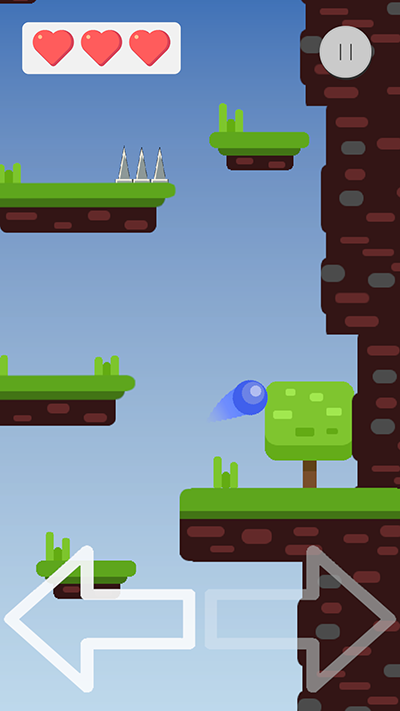
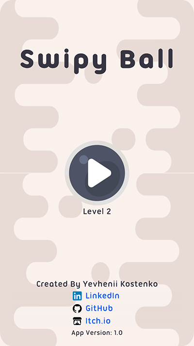

# SwipyBall

Unity gameplay-focused project demonstrating production-level architecture, system design, and performance-aware development.

## Overview
This project is a 2D hypercasual platformer game built to explore scalable gameplay systems and clean Unity architecture.
The goal is not content volume, but robust, extensible engineering solutions applicable to real production environments.

## Techincal Stack
- Unity 6000.0.58f
- Language: C#
- Architecture: modular, system-oriented design
- Target: PC/Android/Web

## Architecture Notes
Key principles used throughout the project:
- separation of data, logic, and presentation
- minimal dependencies between systems
- systems designed for extension, not modification
- avoidance of “God objects” and tightly coupled MonoBehaviours
The project intentionally avoids quick hacks in favor of maintainable long-term solutions.

## Tooling & Debugging
- custom editor tools for faster iteration
- runtime debug overlays
- configurable gameplay data via ScriptableObjects

## Visuals

## Why This Project Exists
This repository reflects how I approach Unity development:
- engineering-first mindset
- ownership of technical decisions
- readiness for production-scale projects

## Status
Actively developed and refactored as a long-term systems playground.